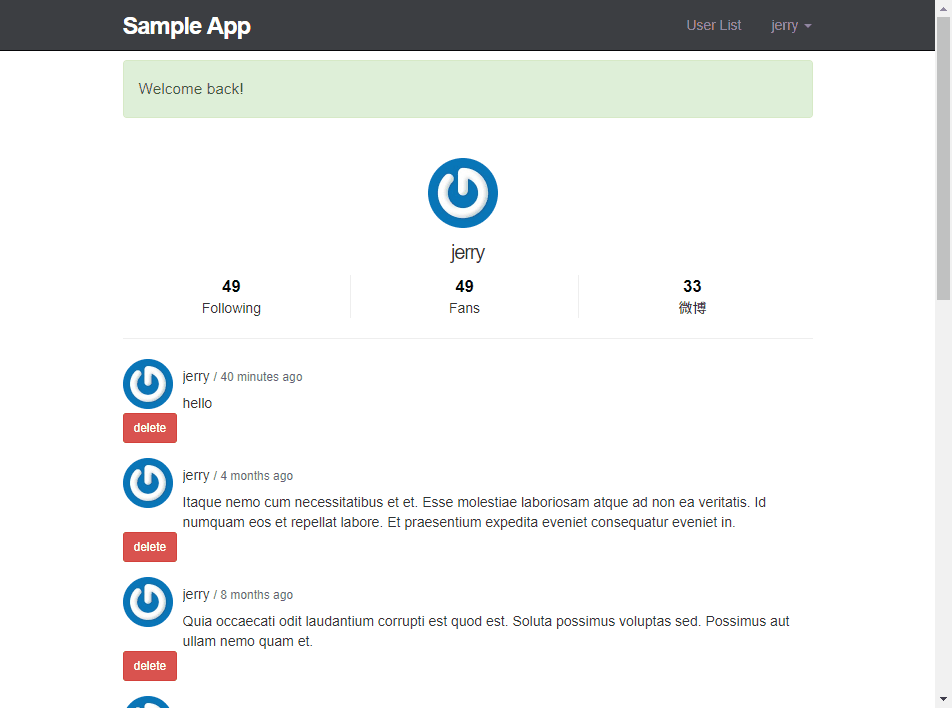

# simple-weibo
A simple weibo-like project 
The purpose of this project is to learn Laravel framwork 



## Main used 
- [Laravel](https://laravel.com/)
- [Homestead](https://laravel.tw/docs/master/homestead)
- [Vagrant](https://www.vagrantup.com/)
- [VirtualBox](https://www.virtualbox.org/)

## Build setup
Install Homestead, Vagrant and VirtualBox
Clone this project
Edit Homestead.yaml in ~/Homestead
```
folders:
    - map: (path of this project)
      to: /home/vagrant/Code
```

```
sites:
    - map: homestead.test
      to: /home/vagrant/Code/Laravel/public
    - map: sample.test 
      to: /home/vagrant/Code/sample/public 
```
Edit hosts file in /etc/hosts  or  C:/Windows/System32/Drivers/etc/hosts
add this line at bottom of file
```
192.168.10.10   sample.test
```
then start up Vagrant 
```
cd ~/Homestead && vagrant up
```
link to sample.test should work
